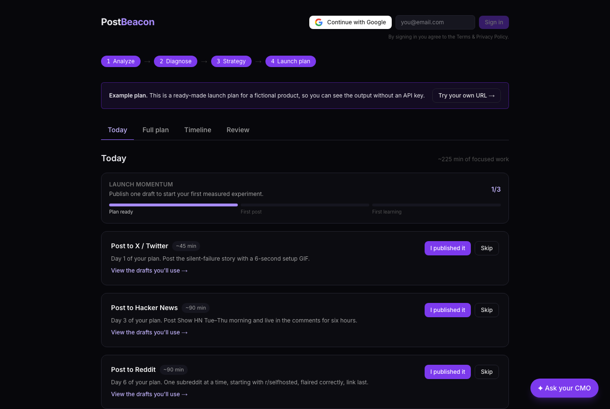
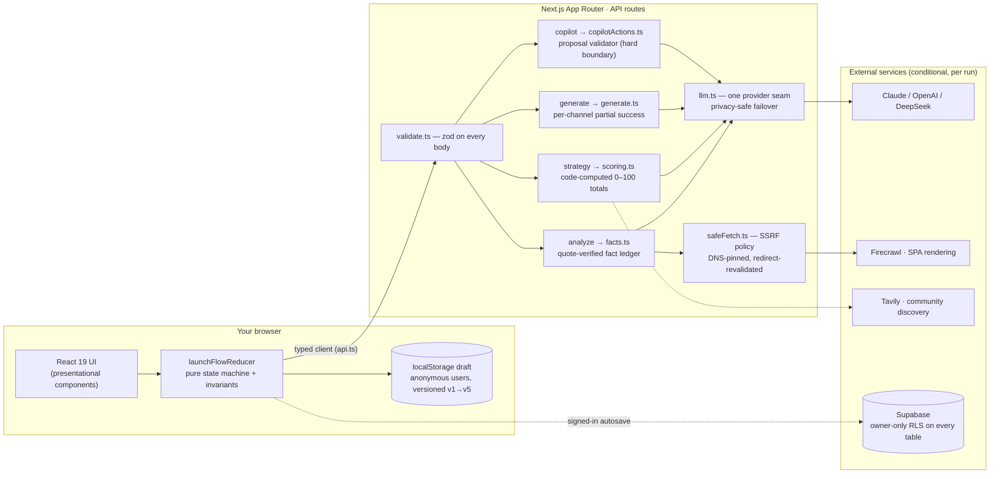
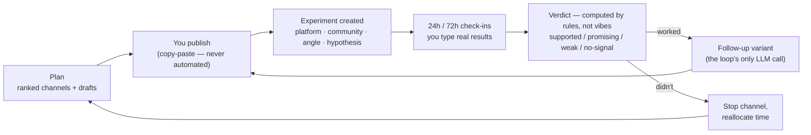

<div align="center">

# PostBeacon

**Your AI CMO. Paste a product URL — get a scored, evidence-separated launch plan you can run today.**

[](https://github.com/zhengbrody/PostBeacon/actions/workflows/ci.yml)
[](./LICENSE)
[](https://nextjs.org)
[](tsconfig.json)

[**Live app**](https://postbeacon.app) · [**Full example plan**](https://postbeacon.app/app?demo=1) (no signup, no API key) · [Privacy](https://postbeacon.app/privacy)



<sub>The launch workspace — every day is ≤3 concrete actions, every post becomes a measured experiment.</sub>

</div>

---

Shipping a product takes a weekend. Launching it — picking the right channels, writing the Show HN that doesn't get flagged, sequencing the posts, sounding like a person instead of a press release — is where most indie products quietly die.

PostBeacon reads your landing page, works out what the product actually is and who'd care, scores 19+ channels **for that specific product**, and hands back a complete go-to-market operating system: positioning, ranked channels with explainable scores, ready-to-post native content, a launch calendar, and a workspace that turns every post into a measured experiment.

**It never posts for you.** Everything is copy-paste, by design — you stay in control and off every platform's automation ban radar. There is no posting capability anywhere in the codebase.

## How it's different

Most "AI marketing" tools generate confident text. PostBeacon is built around a stricter contract:

- **Facts, inferences, and recommendations are separated.** Every claim about your product carries a provenance status (`observed` / `user-confirmed` / `inferred` / `unknown`). "Observed" survives only when the model's evidence quote verifies against your actual page — fabricated evidence is caught in code and demoted. Unknowns stay unknown; the app asks you at most 3 clarifying questions instead of hallucinating answers.
- **Scores are computed, not vibes.** The model rates dimensions (audience fit, intent fit, native-content fit, founder access, risk) with cited evidence; the 0–100 total is a fixed weighted sum **calculated in code**, with the full breakdown shown in the UI.
- **The copilot proposes; you decide.** The Launch Copilot is an action engine with nine structured tools. Every suggestion arrives as a card with a diff, rationale, verified evidence, and plain-language impact — nothing touches your plan until you confirm, destructive changes confirm twice, and every decision lands in an audit log.
- **Learning loops, not one-shot output.** Marking a post published creates an experiment. 24h/72h check-ins collect real results (typed by you — the model can never fabricate metrics into state), a rule-based verdict tells you continue/stop, and the weekly review tracks the only number that matters: completed learning loops.
- **Anti-AI voice enforcement.** A house style bans the tells ("game-changer", "delve", triadic cadence, emoji spam) and writes per-platform personas — HN restrained, Reddit community-member, X hook-not-hype. A banned-phrase linter checks output in CI.

## Quick start

```bash
git clone https://github.com/zhengbrody/PostBeacon.git
cd PostBeacon
npm install
cp .env.example .env     # add at least one model key (below)
npm run dev              # landing at /, app at /app
```

No key handy? `http://localhost:3000/app?demo=1` opens a complete hand-authored example plan.

### Configuration

At least one model key is required; everything else is optional and degrades gracefully.

| Variable | Purpose |
| --- | --- |
| `ANTHROPIC_API_KEY` / `OPENAI_API_KEY` / `DEEPSEEK_API_KEY` | Model providers (pick per run in the UI) |
| `DEFAULT_PROVIDER` | Which configured model the UI selects first. Providers with unclear API data policies are never the silent default and always carry a caution label |
| `SCRAPE_API_KEY` | Firecrawl — headless rendering for client-rendered (SPA) pages |
| `SEARCH_API_KEY` | Tavily — live web search for grounded, link-checked community discovery |
| `NEXT_PUBLIC_SUPABASE_URL` + `NEXT_PUBLIC_SUPABASE_ANON_KEY` | Accounts, autosave, saved projects (run `supabase/schema.sql` once; owner-only RLS on every table) |
| `SUPABASE_SERVICE_ROLE_KEY` | Server-side metering + full account deletion (deletion fails closed without it) |
| `POLAR_ACCESS_TOKEN` + `POLAR_PRODUCT_ID` + `POLAR_WEBHOOK_SECRET` | Billing via Polar (merchant of record); webhook fails closed without the secret |
| `CRON_SECRET` + `RETENTION_DAYS` | Operator data-retention sweep (off by default; the privacy page renders whatever is configured) |
| `NEXT_PUBLIC_FEEDBACK_URL` / `NEXT_PUBLIC_PRIVACY_EMAIL` | Feedback link + monitored privacy contact |

## Architecture

### System overview



Every request body crosses the trust boundary through a zod schema; every user- or model-supplied URL goes through the SSRF policy; the model's output crosses back only after code-side verification (quotes, ids, score ranges). There is deliberately **no posting integration in any layer**.

### The learning loop



The north star metric is **completed learning loops per week** — published → measured → verdict — not how much content got generated.

### Layers

| Layer | Where | Responsibility |
| --- | --- | --- |
| UI | `components/` | Presentational only — no fetches, no business rules |
| State | `hooks/launchFlowReducer.ts` | One pure reducer; `normalize()` makes contradictory plan states unrepresentable |
| Engines | `lib/facts.ts` · `scoring.ts` · `today.ts` · `copilotActions.ts` | Deterministic, unit-tested logic: fact verification, score math, Today derivation, action validation |
| Model seam | `lib/llm.ts` | Three providers behind one function; JSON repair; failover only through clear-policy providers |
| Trust & safety | `lib/validate.ts` · `safeFetch.ts` · `urlPolicy.ts` · `log.ts` | zod on every body, SSRF policy, redacting log sink (`no-console` enforced) |
| Persistence | `lib/storage.ts` · `useAutosave.ts` · `supabase/` | Versioned drafts with migrations; RLS-scoped rows; account-switch hard boundary |

Design rules the codebase holds itself to:

- **One state machine.** All plan state flows through a pure reducer (`hooks/launchFlowReducer.ts`) whose `normalize()` makes contradictory states unrepresentable — no result without its strategy, selections always ⊆ channels, versioned drafts (v1→v5 migrations) for every historical save.
- **Security invariants** (see `AGENTS.md`): every user/model-supplied URL goes through `lib/safeFetch.ts` (SSRF policy: IP-range allowlists, DNS pinned at connect time, per-hop redirect revalidation); every API body is parsed with a zod schema; routes return only public error messages; `no-console` is enforced repo-wide with one redacting log sink.
- **Privacy by design**: no training on your content, no cross-user aggregation, no auto-posting; public privacy/terms/subprocessor pages render from the same source file the code uses (`lib/privacy.ts`), so published claims can't drift from behavior. Export everything as JSON or delete your account from inside the app.

A full architecture map lives in [AGENTS.md](./AGENTS.md); design docs for the trust layer, workspace, copilot action engine, and privacy foundation are in [docs/](./docs).

## Testing

```bash
npm run typecheck        # tsc --noEmit (strict)
npm test                 # 290 offline tests — no API keys needed
npm run lint             # eslint (flat config) incl. no-console
npm run format:check     # prettier
npm run build            # must stay green
RUN_LIVE_EVAL=1 npx vitest run tests/eval.live.test.ts   # live provider eval → eval-results/
```

The offline suite includes 12 golden product fixtures asserting completeness (all 19 platforms, deduped), faithfulness (fabricated evidence demoted), banned-phrase linting, injection resistance for the copilot action boundary, deletion-coverage proofs against the SQL schema, and provider privacy-ordering rules. CI runs all five gates on every push.

## Deployment

Import the repo in [Vercel](https://vercel.com), set the env vars above, point your domain. Accounts need `supabase/schema.sql` run once in the Supabase SQL editor (production repair migrations and a single-query PASS/FAIL audit live in [supabase/](./supabase)). A daily cron (`vercel.json`) drives the optional retention sweep.

## Roadmap

- Chinese platform universe (小红书 / 即刻 / V2EX / 掘金 / B站)
- Cross-project channel analytics on the normalized workspace tables
- Shared projects for small teams

## Contributing

It's a beta and feedback is the roadmap: if a plan is off, a score looks wrong, or the Reddit draft still smells like an ad, [open an issue](https://github.com/zhengbrody/PostBeacon/issues). PRs welcome — keep the five gates green (`typecheck · test · lint · format:check · build`) and match the conventions in [AGENTS.md](./AGENTS.md).

## License

[MIT](./LICENSE)
