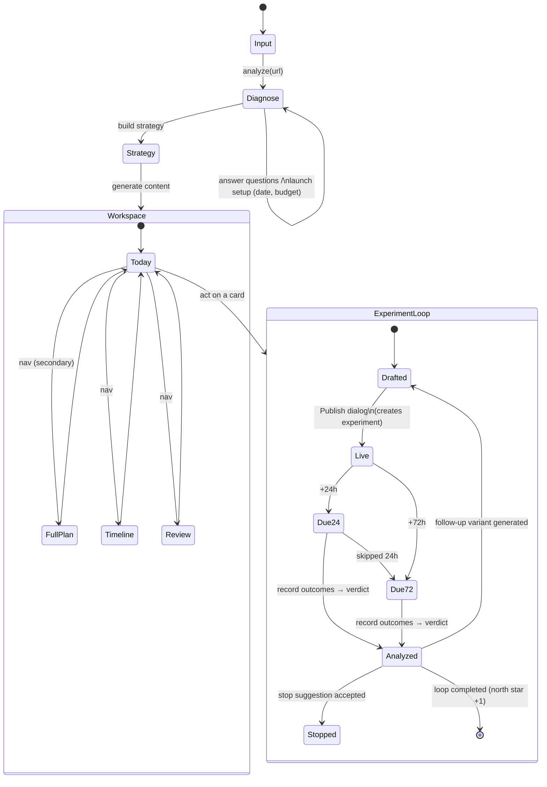

# M15 — Launch Workspace: from one-shot report to a continuing loop

> PRD + user state diagram + acceptance criteria, written before implementation.
> Constraint carried from day one: **PostBeacon never auto-posts.** The workspace
> tracks what the founder does by hand; it never does it for them.

## 1. Problem

PostBeacon today ends at "here is your plan". The founder reads it once, maybe
exports it, and churns. Nothing closes the loop between *posting*, *what
happened*, and *what to do next* — which is exactly the part a solo founder is
worst at doing alone.

## 2. Product thesis & north star

A launch is a sequence of small experiments, not a document. The unit of value
is a **completed learning loop**:

```
publish (by hand) → record outcomes → verdict → next action decided
```

**North star: weekly completed learning loops** (per active campaign).
Explicitly NOT generations, NOT posts drafted — a loop only counts when
outcomes were recorded and a verdict produced a decision.

## 3. Scope (MVP) / non-goals

In: intake (5 workspace facts), Today view (≤3 actions), publish→experiment,
24h/72h check-ins (in-app), instant feedback after outcomes, one-click
follow-up variant OR stop suggestion, Timeline, Weekly Review, persistence
(anon + Supabase) with normalized tables.

Out (documented, deliberate): auto-posting (never), email/push notifications
(no infra; reminders surface in-app), automatic metric scraping (results are
typed or pasted by the user), multi-campaign dashboards (schema supports it;
UI later), team seats.

## 4. Intake (requirement 1)

After analyze, the profile ("Diagnose") step asks — beyond the product
diagnosis — for exactly five workspace facts, reusing the M13 fact system:

| fact | mechanism | storage |
|---|---|---|
| launch goal | existing `conversionGoal` clarifying question (asked when the page doesn't state it) | profile.conversionGoal + fact ledger |
| stage | existing `stage` question | profile.stage + fact ledger |
| available assets | existing `assets` question | profile.assets + fact ledger |
| launch date | **new** Launch setup card (date picker, skippable) | flow state `launchDate` (existed, now asked up front) |
| weekly time budget | **new** Launch setup card (chips: 2/5/10/20 h·week) | flow state `weeklyMinutes` |

Skipping stays honest (M13 rule): skipped items remain unknown; Today copy
degrades gracefully (relative days instead of dates; no budget meter).

## 5. Today view (requirement 2) — the default screen

After generation the user lands on **Today**, not the report. Navigation
(progressive disclosure — one level, four surfaces):

```
Today (default) · Full plan · Timeline · Review
```

The old report (Overview/Content/Calendar/Execute tabs) lives intact under
**Full plan**. Nothing else from the workspace is rendered inside it.

Today shows **at most 3 action cards**, derived (never stored) by a pure
engine `deriveToday(state, now)`:

Priority order:
1. **Record results** — a live experiment whose 24h or 72h checkpoint is due
   and unrecorded (overdue first).
2. **Post** — the next calendar entries whose day has arrived relative to
   launchDate (or, with no date, in calendar order), that have drafted
   content and aren't done/skipped.
3. **Up next** — if fewer than 3, the next upcoming calendar entry (labeled
   as upcoming) or a "review your week" pointer.

Each card: title · **why now** (from the channel's rationale/bestMove + plan
day / hours-since-publish) · **estimated time** (record = 5m; post = from the
catalog effort: low 20m / medium 45m / high 90m) · **the content it uses**
(jump to that channel's drafts in Full plan) · **Done / Skip**.

"Done" on a post card opens the Publish dialog (below) — because done means
published. Skip records a skipped task (excluded from future derivation).
A small budget line shows `est. minutes of shown actions / weekly budget`.

## 6. Publish → experiment (requirement 3)

Marking a post as published (from a Today card or a post card in Full plan)
opens a lightweight dialog — everything prefilled, two optional fields:

```
platform     fixed (the channel)
community    prefill: recommendation.venue        (editable)
angle        prefill: recommendation.angle        (editable)
variant      the hook actually used (current A/B pick)
trackedUrl   optional (the live post URL)
publishedAt  now
hypothesis   generated template: "«angle» on «community» will produce
             «goal» signal within 72h"
```

Confirming creates an **Experiment** (status `live`), marks the task done and
the post as posted. Un-marking a post later does not delete the experiment
(history is history); experiments can be explicitly stopped.

## 7. Check-ins & outcomes (requirement 4)

At `publishedAt + 24h` and `+72h` a **Record results** card appears on Today
(and a count badge on the Today nav item). No email/push in MVP — the
reminder is the workspace itself. The outcome form takes:

`impressions · replies · clicks · signups · revenue` (all optional numbers)
+ `qualitativeFeedback` (textarea — paste anything: comments, DMs, notes).

Manual entry only, by design. Numbers the user didn't enter are treated as
"not measured", never as 0.

## 8. Instant feedback (requirement 5)

Saving an outcome immediately produces, **in code** (deterministic,
explainable — same trust posture as M13 scoring):

**Verdict** on the experiment's hypothesis:

| call | rule (first match) | meaning |
|---|---|---|
| supported | signups > 0 or revenue > 0 | the angle converts — the hypothesis held |
| promising | replies ≥ 3 or clicks ≥ 10 | engagement without conversion yet |
| weak | impressions ≥ 200, engagement below the above | reach but no bite — angle problem |
| no-signal | otherwise | distribution problem or too early |

Plus: **which angle/channel to continue** (supported/promising → double down
on this channel, adjacent community next; weak → same channel, new angle;
no-signal at 24h → wait for 72h; at 72h → stop suggestion), **≤3 next
actions** (fed back into Today), and one of:

- **Generate follow-up variant** — one click; calls the existing
  `/api/copilot` rewrite action with a direction built from the outcome data
  ("keep the X, replace the Y angle…"); the returned rewrite is appended to
  the channel's drafts as a new variant post. (LLM used only here, on demand.)
- **Stop suggestion** — marks the experiment `stopped`; Today reallocates to
  the next-ranked channel.

## 9. Timeline & Weekly Review (requirement 6)

**Timeline**: reverse-chronological feed derived from workspace events —
published (experiment created), outcome recorded (+verdict), variant added,
experiment stopped, task skipped. No new storage; it's a projection.

**Weekly Review**: for the current ISO week —
- **North star: completed learning loops** (count + the loop list),
- channel scoreboard (experiments, outcomes, verdict calls per channel),
- best angle so far (highest-verdict experiment),
- up to 3 suggestions for next week (from verdicts + unposted top channels).

## 10. User state diagram



## 11. Data model & persistence (requirement 7)

### In-memory (single source: the flow reducer)

```ts
weeklyMinutes?: number
experiments: Experiment[]   // {id, platformId, community, angle, variant,
                            //  hypothesis, trackedUrl?, publishedAt, status,
                            //  postIdx, outcomes: Outcome[], verdict?}
taskLog: TaskRecord[]       // {id, kind, title, status: done|skipped, at,
                            //  estMinutes} — acted-on tasks only; Today
                            //  derivation excludes these ids
```

### Persistence tiers (local degradation, explicit)

| tier | when | where |
|---|---|---|
| anon | no Supabase keys | localStorage draft `workspace` field — **DRAFT_SCHEMA_VERSION 4** (migration: v<4 → `workspace: {experiments:[], taskLog:[]}`) |
| signed-in, tables not migrated | Supabase keys, schema.sql not re-run | `projects.meta.workspace` jsonb (works with zero SQL — this IS the degradation path) |
| signed-in, tables present | schema.sql applied | meta.workspace (hydration source) **+ write-through to normalized tables** (canonical for queries/analytics; feature-detected once per session, best-effort) |

MVP reads hydrate from meta/draft (one fetch, all generations of saves keep
working); the normalized tables are write-through mirrors that make outcomes
queryable and unlock future cross-campaign views. Documented trade-off:
mirrors can lag if a write fails mid-session; the jsonb copy is authoritative.

### Supabase schema (additive migration in supabase/schema.sql)

```
campaigns    id pk · user_id fk · project_id fk unique · goal · stage ·
             launch_date · weekly_minutes · created_at/updated_at
experiments  id pk · campaign_id fk · user_id · platform_id · community ·
             angle · variant · hypothesis · tracked_url · status · post_idx ·
             published_at
outcomes     id pk · experiment_id fk · user_id · checkpoint(24h|72h|manual) ·
             impressions · replies · clicks · signups · revenue ·
             qualitative_feedback · recorded_at
tasks        (campaign_id, id) pk · user_id · kind · title · status ·
             est_minutes · acted_at
```

RLS on all four: `user_id = auth.uid()` for select/insert/update/delete
(same pattern as `projects`). All statements `create table if not exists` —
safe to re-run.

Production verification on 2026-07-13 found that these four mirror tables had
not been installed: the app had correctly degraded to
`projects.meta.workspace`. The atomic repair migration was applied and the
final production audit now reports all seven checks as `PASS`, including every
RLS policy and parent/auth cascade.

## 12. Progressive disclosure rules

- Post-generation lands on **Today only** — 3 cards max, one budget line.
- A compact **Launch momentum** path makes first value explicit: Plan ready →
  First post → First learning. It is derived from this user's workspace only;
  no cross-user analytics or new stored event stream is introduced.
- Full plan / Timeline / Review are one tap away, never inlined into Today.
- The Publish dialog appears only on "Done/Mark as posted"; outcome form only
  from a due card or an experiment row; the feedback panel only right after
  saving an outcome. Review is a tab, not a popup.
- Empty states never render dead modules: no experiments → Timeline/Review
  show a single line pointing back to Today.

## 13. Acceptance criteria

Intake
- [x] A1. After analyze, the Diagnose step asks for goal/stage/assets (existing questions when unknown) AND launch date + weekly time budget (always shown until answered/skipped).
- [x] A2. Every intake item is skippable; skipping never blocks progressing.

Today
- [x] B1. After generation the user lands on Today, not the report.
- [x] B2. Today never shows more than 3 action cards.
- [x] B3. Every card shows why-now, estimated minutes, links to the content it uses, and Done/Skip controls.
- [x] B4. The full report is reachable under "Full plan" and is unchanged (Overview/Content/Calendar/Execute, printing included).
- [x] B5. Skipped cards don't reappear; done post-cards require the Publish dialog.
- [x] B6. Launch momentum advances only from real state (plan, experiment,
  verdict) and points to the next first-value action.

Experiments
- [x] C1. Confirming the Publish dialog creates an experiment with platform, community, angle, variant, publishedAt, trackedUrl (optional) and a generated hypothesis.
- [x] C2. No network posting occurs anywhere (no external POSTs to platforms).

Check-ins & outcomes
- [x] D1. At publishedAt+24h a Record card appears on Today (and a nav badge); same at +72h; overdue check-ins outrank post cards.
- [x] D2. Outcome form accepts the six fields, all optional except at least one filled; unset numbers are stored as absent, not 0.

Feedback
- [x] E1. Saving an outcome immediately shows a verdict (supported/promising/weak/no-signal) with the rule that fired, in plain language.
- [x] E2. The panel names the channel/angle to continue or stop, and lists ≤3 next actions.
- [x] E3. One click generates a follow-up variant (appended to the channel's drafts) OR applies the stop suggestion — variant text comes from the model; verdict/advice never does.

Timeline & Review
- [x] F1. Timeline lists workspace events newest-first with timestamps.
- [x] F2. Review shows weekly completed learning loops as the headline number (a loop = published + outcome recorded + verdict), plus a channel scoreboard and ≤3 next-week suggestions.

Persistence
- [x] G1. Anonymous: full workspace state survives reload via the versioned draft (v4 migration; v3 drafts load cleanly with an empty workspace).
- [x] G2. Signed-in without new tables: workspace survives via projects.meta (no SQL required).
- [x] G3. With schema.sql applied: campaigns/experiments/outcomes/tasks rows are written with RLS restricting access to the owner.
- [x] G4. Loading any pre-M15 save renders the workspace with an empty loop history and a working Today.

Gates
- [x] H1. typecheck / offline tests / lint / format / build all green; engine and migration behavior unit-tested; flow verified in the browser.
